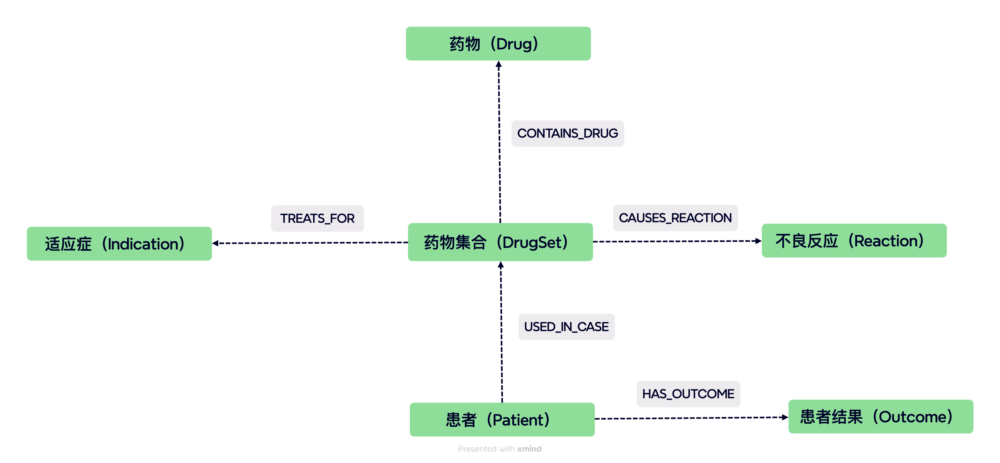

FAERS构建agent项目。

# 知识图谱节点关系如下

#  FAERS 不良反应标签分析

## 一、标签分类结构

为便于理解和建模，不良反应（Reaction）标签按照性质可分为以下三大类：

| 类别 | 示例 | 中文释义 | 说明 |
|------|------|----------|------|
| **用药方式类** | Off label use Product dose omission issue | 超说明书使用、漏服 / 未按剂量使用 | 与药品使用方式相关的问题 |
| **疗效类** | Drug ineffective | 药物无效 | 表示药物未达到预期治疗效果 |
| **生理反应类** | Fatigue, Nausea, Rash, Headache 等 | 疲劳、恶心、皮疹、头痛等 | 药物引发的身体反应，是最主要的标签类型 |

---

## 二、生理反应类统计分析

在排除「Off label use」「Drug ineffective」「Product dose omission issue」三类非生理标签后，共保留：

- **总记录数**：≈ 209,938 条  
- **唯一标签数**：≈ 7,201 种  
- **平均每例（case）生理反应数**：≈ 4.9 个  
- **中位数**：3 个反应  
- **最大值**：165 个反应（个别病例）  
- **只出现一次的标签占比**：约 **29.8%**

### 🔝 Top 10 常见生理反应

| 排名 | 英文标签 | 中文释义 | 占比（约） |
|------|-----------|----------|-------------|
| 1 | Fatigue | 疲劳 / 乏力 | 1.38% |
| 2 | Diarrhoea | 腹泻 | 1.30% |
| 3 | Nausea | 恶心 | 1.28% |
| 4 | Headache | 头痛 | 1.11% |
| 5 | Pain | 疼痛 | 1.06% |
| 6 | COVID-19 | 新冠感染 | 1.04% |
| 7 | Dyspnoea | 呼吸困难 | 1.03% |
| 8 | Vomiting | 呕吐 | 0.96% |
| 9 | Pyrexia | 发热 | 0.91% |
| 10 | Dizziness | 头晕 | 0.84% |

> 前 **765 种反应标签** 已覆盖约 **80%** 的全部生理反应记录，  
> 表明存在典型的「长尾分布」特征。

---

## 三、不良反应总体分布

包含所有类型的标签（共 216,507 条记录，7,204 种标签）：

- **平均每例反应数**：5.06  
- **中位数**：3  
- **标准差**：≈ 7.0  
- **最小值 / 最大值**：1 / 167  

### 🔝 Top 10 不良反应总体标签

| 排名 | Reaction | 中文释义 | 类别 |
|------|-----------|----------|------|
| 1 | Off label use | 超说明书使用 | 用药方式类 |
| 2 | Fatigue | 疲劳 | 生理反应类 |
| 3 | Diarrhoea | 腹泻 | 生理反应类 |
| 4 | Nausea | 恶心 | 生理反应类 |
| 5 | Headache | 头痛 | 生理反应类 |
| 6 | Pain | 疼痛 | 生理反应类 |
| 7 | COVID-19 | 新冠感染 | 生理反应类 |
| 8 | Dyspnoea | 呼吸困难 | 生理反应类 |
| 9 | Vomiting | 呕吐 | 生理反应类 |
| 10 | Pyrexia | 发热 | 生理反应类 |

> 前 **740 种反应标签** 即覆盖约 **80%** 的所有记录，  
> 说明 FAERS 数据中的不良反应类型分布高度集中。

---

## 四、统计特征与规律

- **标签多样性高**：共 7,200+ 种不良反应，其中约三成仅出现一次，说明病例个体差异较大。  
- **分布呈长尾趋势**：少数常见反应（如疲劳、恶心、头痛）占据主要比例。  
- **生理反应主导**：大部分记录为生理性不良反应，疗效及用药方式类占比较小。  
- **病例复杂度高**：平均每例报告涉及约 5 个不同的不良反应，说明单个事件往往伴随多症状共现。  

---
